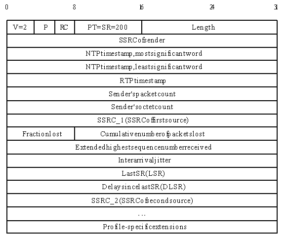

(1条消息)RTP协议分析_Java_蓝精灵的专栏-CSDN博客 - https://blog.csdn.net/u011006622/article/details/80675054

# RTP协议分析

## 第1章.   RTP概述

## 1.1. RTP是什么

RTP全名是Real-time Transport Protocol（实时传输协议）。它是IETF提出的一个标准，对应的RFC文档为RFC3550（RFC1889为其过期版本）。RFC3550不仅定义了RTP，而且定义了配套的相关协议RTCP（Real-time Transport Control Protocol，即实时传输控制协议）。RTP用来为IP网上的语音、图像、传真等多种需要实时传输的多媒体数据提供端到端的实时传输服务。RTP为Internet上端到端的实时传输提供时间信息和流同步，但并不保证服务质量，服务质量由RTCP来提供。

## 1.2. RTP的应用环境

RTP用于在单播或多播网络中传送实时数据。它们典型的应用场合有如下几个。

简单的多播音频会议。语音通信通过一个多播地址和一对端口来实现。一个用于音频数据（RTP），另一个用于控制包（RTCP）。

音频和视频会议。如果在一次会议中同时使用了音频和视频会议，这两种媒体将分别在不同的RTP会话中传送，每一个会话使用不同的传输地址（IP地址＋端口）。如果一个用户同时使用了两个会话，则每个会话对应的RTCP包都使用规范化名字CNAME（Canonical Name）。与会者可以根据RTCP包中的CNAME来获取相关联的音频和视频，然后根据RTCP包中的计时信息(Network time protocol)来实现音频和视频的同步。

翻译器和混合器。翻译器和混合器都是RTP级的中继系统。翻译器用在通过IP多播不能直接到达的用户区，例如发送者和接收者之间存在防火墙。当与会者能接收的音频编码格式不一样，比如有一个与会者通过一条低速链路接入到高速会议，这时就要使用混合器。在进入音频数据格式需要变化的网络前，混合器将来自一个源或多个源的音频包进行重构，并把重构后的多个音频合并，采用另一种音频编码进行编码后，再转发这个新的RTP包。从一个混合器出来的所有数据包要用混合器作为它们的同步源（SSRC，见RTP的封装）来识别，可以通过贡献源列表（CSRC表，见RTP的封装）可以确认谈话者。

## 1.3. 相关概念

### 1.3.1. 流媒体

流媒体是指Internet上使用流式传输技术的连续时基媒体。当前在Internet上传输音频和视频等信息主要有两种方式：下载和流式传输两种方式。

下载情况下，用户需要先下载整个媒体文件到本地，然后才能播放媒体文件。在视频直播等应用场合，由于生成整个媒体文件要等直播结束，也就是用户至少要在直播结束后才能看到直播节目，所以用下载方式不能实现直播。

流式传输是实现流媒体的关键技术。使用流式传输可以边下载边观看流媒体节目。由于Internet是基于分组传输的，所以接收端收到的数据包往往有延迟和乱序（流式传输构建在UDP上）。要实现流式传输，就是要从降低延迟和恢复数据包时序入手。在发送端，为降低延迟，往往对传输数据进行预处理（降低质量和高效压缩）。在接收端为了恢复时序，采用了接收缓冲；而为了实现媒体的流畅播放，则采用了播放缓冲。

使用接收缓冲，可以将接收到的数据包缓存起来，然后根据数据包的封装信息（如包序号和时戳等），将乱序的包重新排序，最后将重新排序了的数据包放入播放缓冲播放。

为什么需要播放缓冲呢？容易想到，由于网络不可能很理想，并且对数据包排序需要处理时耗，我们得到排序好的数据包的时间间隔是不等的。如果不用播放缓冲，那么播放节目会很卡，这叫时延抖动。相反，使用播放缓冲，在开始播放时，花费几十秒钟先将播放缓冲填满（例如PPLIVE），可以有效地消除时延抖动，从而在不太损失实时性的前提下实现流媒体的顺畅播放。

到目前为止,Internet 上使用较多的流式视频格式主要有以下三种:RealNetworks 公司的RealMedia ,Apple 公司的QuickTime 以及Microsoft 公司的Advanced Streaming Format (ASF) 。

上面在谈接收缓冲时，说到了流媒体数据包的封装信息（包序号和时戳等），这在后面的RTP封装中会有体现。另外，RealMedia这些流式媒体格式只是编解码有不同，但对于RTP来说，它们都是待封装传输的流媒体数据而没有什么不同。

# 第2章.   RTP详解

## 2.1. RTP的协议层次

### 2.1.1. 传输层的子层

RTP（实时传输协议），顾名思义它是用来提供实时传输的，因而可以看成是传输层的一个子层。图 1给出了流媒体应用中的一个典型的协议体系结构。

图 1 流媒体体系结构

从图中可以看出，RTP被划分在传输层，它建立在UDP上。同UDP协议一样，为了实现其实时传输功能，RTP也有固定的封装形式。RTP用来为端到端的实时传输提供时间信息和流同步，但并不保证服务质量。服务质量由RTCP来提供。这些特点，在第4章可以看到。

### 2.1.2. 应用层的一部分

不少人也把RTP归为应用层的一部分，这是从应用开发者的角度来说的。操作系统中的TCP/IP等协议栈所提供的是我们最常用的服务，而RTP的实现还是要靠开发者自己。因此从开发的角度来说，RTP的实现和应用层协议的实现没不同，所以可将RTP看成应用层协议。

RTP实现者在发送RTP数据时，需先将数据封装成RTP包，而在接收到RTP数据包，需要将数据从RTP包中提取出来。

## 2.2. RTP的封装

一个协议的封装是为了满足协议的功能需求的。从前面提出的功能需求，可以推测出RTP封装中应该有同步源和时戳等字段，但更为完整的封装是什么样子呢？请看图2。

图2 RTP的头部格式

版本号（V：version）：2比特，用来标志使用的RTP版本。

填充位（P:padding）：1比特，如果该位置位，则该RTP包的尾部就包含附加的填充字节。

扩展位（X:extension）：1比特，如果该位置位的话，RTP固定头部后面就跟有一个扩展头部。

CSRC计数器（CC:CSRC count）：4比特，含有固定头部后面跟着的CSRC的数目。

标记位（M:marker）：1比特,该位的解释由配置文档（Profile）来承担.

载荷类型（PT:payload type）：7比特，标识了RTP载荷的类型。

序列号（SN）：16比特，发送方在每发送完一个RTP包后就将该域的值增加1，接收方可以由该域检测包的丢失及恢复包序列。序列号的初始值是随机的。

时间戳：32比特，记录了该包中数据的第一个字节的采样时刻。在一次会话开始时，时间戳初始化成一个初始值。即使在没有信号发送时，时间戳的数值也要随时间而不断地增加（时间在流逝嘛）。时间戳是去除抖动和实现同步不可缺少的。

同步源标识符(SSRC)：32比特，同步源就是指RTP包流的来源。在同一个RTP会话中不能有两个相同的SSRC值。该标识符是随机选取的 RFC1889推荐了MD5随机算法。`//jdy:可以是自定义的随便一个数`

贡献源列表（CSRC List）：0～15项，每项32比特，用来标志对一个RTP混合器产生的新包有贡献的所有RTP包的源。由混合器将这些有贡献的SSRC标识符插入表中。SSRC标识符都被列出来，以便接收端能正确指出交谈双方的身份。

## 2.3. RTCP的封装

RTP需要RTCP为其服务质量提供保证，因此下面介绍一下RTCP的相关知识。

RTCP的主要功能是：服务质量的监视与反馈、媒体间的同步，以及多播组中成员的标识。在RTP会话期 间，各参与者周期性地传送RTCP包。RTCP包中含有已发送的数据包的数量、丢失的数据包的数量等统计资料，因此，各参与者可以利用这些信息动态地改变传输速率，甚至改变有效载荷类型。RTP和RTCP配合使用，它们能以有效的反馈和最小的开销使传输效率最佳化，因而特别适合传送网上的实时数据。

从图 1可以看到，RTCP也是用UDP来传送的，但RTCP封装的仅仅是一些控制信息，因而分组很短，所以可以将多个RTCP分组封装在一个UDP包中。RTCP有如下五种分组类型。

| 类型 | 缩写表示                         | 用途       |
| ---- | -------------------------------- | ---------- |
| 200  | SR（Sender Report）              | 发送端报告 |
| 201  | RR（Receiver Report）            | 接收端报告 |
| 202  | SDES（Source Description Items） | 源点描述   |
| 203  | BYE                              | 结束传输   |
| 204  | APP                              | 特定应用   |

表 1 RTCP的5种分组类型

上述五种分组的封装大同小异，下面只讲述SR类型，而其它类型请参考RFC3550。

发送端报告分组SR（Sender Report）用来使发送端以多播方式向所有接收端报告发送情况。SR分组的主要内容有：相应的RTP流的SSRC，RTP流中最新产生的RTP分组的时间戳和NTP，RTP流包含的分组数，RTP流包含的字节数。SR包的封装如图3所示。

图3 RTCP的头部格式

版本（V）：同RTP包头域。

填充（P）：同RTP包头域。

接收报告计数器（RC）：5比特，该SR包中的接收报告块的数目，可以为零。

包类型（PT）：8比特，SR包是200。

长度域（Length）：16比特，其中存放的是该SR包以32比特为单位的总长度减一。

同步源（SSRC）：SR包发送者的同步源标识符。与对应RTP包中的SSRC一样。

NTP Timestamp（Network time protocol）SR包发送时的绝对时间值。NTP的作用是同步不同的RTP媒体流。

RTP Timestamp：与NTP时间戳对应，与RTP数据包中的RTP时间戳具有相同的单位和随机初始值。

Sender’s packet count：从开始发送包到产生这个SR包这段时间里，发送者发送的RTP数据包的总数. SSRC改变时，这个域清零。

Sender`s octet count：从开始发送包到产生这个SR包这段时间里，发送者发送的净荷数据的总字节数（不包括头部和填充）。发送者改变其SSRC时，这个域要清零。

同步源n的SSRC标识符：该报告块中包含的是从该源接收到的包的统计信息。

丢失率（Fraction Lost）：表明从上一个SR或RR包发出以来从同步源n(SSRC_n)来的RTP数据包的丢失率。

累计的包丢失数目：从开始接收到SSRC_n的包到发送SR,从SSRC_n传过来的RTP数据包的丢失总数。

收到的扩展最大序列号：从SSRC_n收到的RTP数据包中最大的序列号，

接收抖动（Interarrival jitter）：RTP数据包接受时间的统计方差估计

上次SR时间戳（Last SR,LSR）：取最近从SSRC_n收到的SR包中的NTP时间戳的中间32比特。如果目前还没收到SR包，则该域清零。

上次SR以来的延时（Delay since last SR,DLSR）：上次从SSRC_n收到SR包到发送本报告的延时。

## 2.4. RTP的会话过程

当应用程序建立一个RTP会话时，应用程序将确定一对目的传输地址。目的传输地址由一个网络地址和一对端口组成，有两个端口：一个给RTP包，一个给RTCP包，使得RTP/RTCP数据能够正确发送。RTP数据发向偶数的UDP端口，而对应的控制信号RTCP数据发向相邻的奇数UDP端口（偶数的UDP端口＋1），这样就构成一个UDP端口对。 RTP的发送过程如下，接收过程则相反。

1)    RTP协议从上层接收流媒体信息码流（如H.263），封装成RTP数据包；RTCP从上层接收控制信息，封装成RTCP控制包。

2)    RTP将RTP 数据包发往UDP端口对中偶数端口；RTCP将RTCP控制包发往UDP端口对中的接收端口

# 参考资料

[1]   RFC文档：RFC3550对应RTP/RTCP，RFC2362对应RTSP，RFC2208对应RSVP

[2]   http://www.faqs.org/rfcs/，上面有全面的英文RFC文档

[3]   http://www.cnpaf.net/，有不少协议分析文档，也有中文RFC文档，但质量不是特别高。